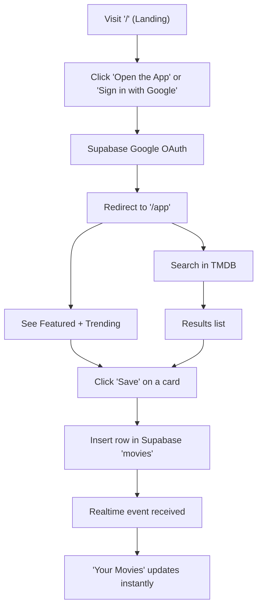
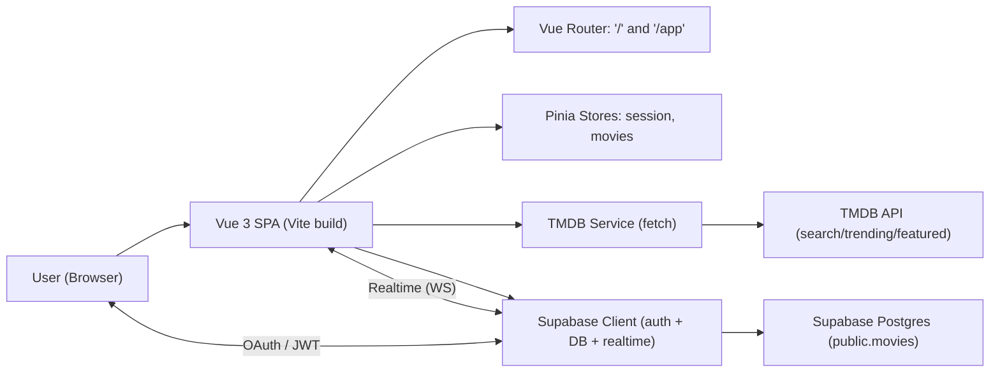

# Product Requirements Document (PRD) — Movie Explorer (Vue 3 + Vite + Tailwind)

## Overview
Movie Explorer is a single‑page application built with Vue 3, Vite, and TailwindCSS that provides an elegant, accessible interface for discovering and saving movies. The app integrates:
- Supabase for Google OAuth authentication and realtime CRUD on a per‑user movies table
- TMDB API for search, trending, and featured movie data

The application has two primary routes:
- “/” Landing: a marketing/intro view with transparent Navbar and calls to action to sign in or open the app
- “/app” App Shell: the main authenticated experience with a search bar, Trending and Featured sections from TMDB, and a “Your Movies” panel backed by Supabase

Royal Purple is the visual theme, emphasizing elegant, refined UI with accessible defaults and smooth loading experiences.

## Objectives and Success Metrics
### Objectives
- Provide a fast, intuitive experience for browsing, searching, and saving movies
- Make authentication effortless with Google OAuth via Supabase
- Keep users’ saved movie lists in sync in real time across sessions and devices
- Maintain strong accessibility, security, and performance baselines

### Success Metrics
- Authentication success rate ≥ 98% (successful Google OAuth sign‑ins/attempts)
- Time to first interactive search (typing to results) ≤ 1.0s on typical broadband
- LCP ≤ 2.5s on mid‑tier mobile for initial route; CLS < 0.1; INP < 200ms
- Realtime sync latency for new saves ≤ 1.5s to appear in “Your Movies”
- Error rate (API/Supabase calls) ≤ 1% during normal operation
- Retention proxy: ≥ 40% of signed‑in users save at least 1 movie in first session

## Scope
### In Scope
- Two routes: Landing “/” and App Shell “/app”
- Supabase Google OAuth sign‑in/sign‑out; session persistence
- Realtime CRUD for user’s movies table with RLS policies
- TMDB integrations: search, trending/week, featured (top rated)
- Save‑from‑card UX (save button on result/trending/featured cards)
- Session‑aware Navbar and “Your Movies” panel
- Royal Purple theme, responsive design, and accessible patterns
- CSP meta for dev/preview and production guidance for server headers
- Performance optimizations: skeletons, debounce search, route code-splitting

### Out of Scope (for MVP)
- Dedicated movie details route or modal (fetch API exists, UI not yet implemented)
- Social sharing, comments, ratings, or watchlists beyond “save”
- Admin dashboards or moderation tools
- Offline support or local caching beyond in‑memory state
- Payments or subscriptions

## Personas
- Casual Browser: Wants to quickly discover trending or highly rated films and occasionally save a few favorites. Requires effortless search, clean grid displays, and a simple save action.
- Movie Enthusiast: Frequently searches and browses. Expects rich metadata, stable performance, and a reliable personal list. Sensitive to duplications and wants immediate feedback when saving/removing movies.
- Returning User: Already authenticated, expects to land in “/app” and see their personal list and current trending content ready without delays.

## User Journeys
- Landing to App: User visits “/”, reads intro, clicks “Open the App” or “Sign in with Google,” completes Google OAuth, and returns to “/app”.
- Search and Save: User types in the search bar, results appear with debounced queries, user taps “Save” on a card, and “Your Movies” updates instantly and via realtime.
- Passive Browse: User scrolls Trending and Featured lists, examines poster/title, and saves interesting items without entering a dedicated detail page.

### User Flow Diagram

## Detailed User Stories with Acceptance Criteria
1) As an unauthenticated user, I want to see a marketing landing page so I can understand the app and sign in or proceed to the app.
- Acceptance:
  - Landing page accessible at “/”
  - Navbar is transparent; primary CTA buttons visible
  - Pressing “Open the App” routes to “/app”
  - Sign in button triggers Google OAuth

2) As a user, I want to authenticate with Google so that my movie list is personalized and persisted.
- Acceptance:
  - Clicking “Sign in with Google” initiates Supabase OAuth
  - After OAuth, user is redirected to “/app”
  - Session persists across reloads
  - Sign out button clears session and shows logged‑out state

3) As an authenticated user, I want to search TMDB for movies so that I can quickly find specific titles.
- Acceptance:
  - Search input debounces requests
  - Results list updates after queries
  - Empty query clears results and shows Trending
  - Network errors show non‑intrusive feedback in console or UI hint

4) As a user, I want to see Trending and Featured movies so I can discover interesting content.
- Acceptance:
  - “Trending This Week” and “Featured” appear in the app shell
  - Placeholders (skeletons) are shown during loading
  - Lists are responsive and accessible (ARIA status while loading)

5) As an authenticated user, I want to save movies to my personal list so I can revisit them later.
- Acceptance:
  - Each movie card shows a “Save” button (enabled only when not saved)
  - Clicking “Save” inserts a row into Supabase “movies”
  - Unique constraint prevents duplicate saves per user+TMDB id
  - UI reflects Saved state; realtime updates ensure consistency

6) As an authenticated user, I want to remove saved movies from my list so I can manage it over time.
- Acceptance:
  - “Your Movies” panel lists saved movies
  - Clicking “Remove” deletes the row for that movie
  - List updates optimistically and via realtime

7) As a signed‑in user, I want consistent realtime updates so that “Your Movies” remains in sync if I add/remove movies in another tab.
- Acceptance:
  - Realtime channel subscribed to user‑filtered “movies” events
  - INSERT/UPDATE/DELETE events update local state without duplication
  - Subscription refreshes appropriately on login/logout changes

Note: Movie details view is future scope; the API function exists but no route/modal is required for MVP.

## Functional Requirements
### Application Structure and Routes
- “/” Landing View
  - Transparent Navbar
  - Hero section with headline, description, CTA buttons
  - Secondary CTA: “Sign in with Google”
- “/app” App Shell
  - Session‑aware Navbar with Auth status and actions
  - Search bar with debounce and visible loading affordances
  - Featured carousel
  - Trending grid
  - “Your Movies” panel (list saved items with remove action)
- 404 Not Found view

### Authentication
- Provider: Supabase Google OAuth
- Redirect target: window.location.origin + “/app”
- Session persistence and auto refresh must be enabled in Supabase client
- Sign in/out exposed via session store actions

### Movies CRUD (Supabase)
- Table: public.movies
- Row Level Security enabled, policies restrict reads/writes to row owner
- Unique index on (user_id, tmdb_id) prevents duplicates
- Create: Save from card inserts title, tmdb_id, poster_path, and user_id
- Read: Load user’s movies ordered by created_at descending
- Delete: Remove by row id or by TMDB id for the current user
- Realtime: Subscribe to INSERT/UPDATE/DELETE filtered by user_id to update local state

### TMDB Integrations
- Centralized configuration with Authorization: Bearer token
- Search: GET /search/movie
- Trending: GET /trending/movie/week
- Featured: GET /movie/top_rated
- Details: GET /movie/{id} with api_key param added (API available; UI later phase)
- If TMDB key missing, features are disabled and a console warning is shown

### Save-from-Card UX
- Each MovieCard shows Save if authenticated and not already saved
- Disabled state for already saved items or during in‑flight save
- Clear feedback for saving state; failure surface as unobtrusive error text when applicable

## Non‑Functional Requirements
### Performance
- Route‑level code splitting for major views
- Skeleton loaders with shimmer to reduce perceived latency
- Debounced search to limit chatter
- Reserved aspect ratio wrappers to minimize CLS
- Targets: LCP ≤ 2.5s, CLS < 0.1, INP < 200ms on mid‑tier mobile
- NFRs aligned with “Performance Optimization Guide”; future improvements include request cancellation, in‑memory caching, responsive images with srcset

### Accessibility
- Semantic regions and roles (e.g., role="status", aria‑busy during loading)
- Visible focus states via utility classes
- ALT text on images, labels for inputs and interactive controls
- Keyboard navigation without traps; focus management for dialogs (if added later)
- Color contrast meets WCAG AA within Royal Purple palette

### Security
- Supabase RLS ensures per‑user data isolation
- OAuth handled by Supabase SDK with session persistence
- CSP meta in index.html restricts origins to self, *.supabase.co, api.themoviedb.org, image.tmdb.org; ws/wss for dev/HMR
- Production guidance for setting strict server headers (HSTS, X‑Content‑Type‑Options, X‑Frame‑Options, Referrer‑Policy, Permissions‑Policy)
- No secrets committed; environment variables prefixed with VITE_ for Vite exposure

### Reliability
- Realtime subscription maintains up‑to‑date movies list
- Optimistic updates paired with realtime reconciliation
- Graceful handling of missing environment variables and API errors (console warnings, UI hints)
- No offline mode required for MVP

## UX/UI and Theming (Royal Purple Style Guide)
- Primary color: #8B5CF6; Secondary: #6B7280; Background: #F3E8FF; Surface: #FFFFFF; Text: #374151
- Gradients: from‑purple‑100 to purple‑300; refined rounded components (rounded‑xl) and soft shadows
- Responsive design: grid layouts adapt from 2 to 6 columns; carousels scroll horizontally
- Loading states: skeleton components with subtle shimmer
- Focus indicators: focus‑ring utility for keyboard accessibility
- Typography: legible defaults per Tailwind setup; headings emphasize elegance

## Data Model
- Table: public.movies
  - id: bigint identity primary key
  - user_id: uuid (references auth.users)
  - title: text not null
  - tmdb_id: integer nullable (unique in combination with user_id)
  - poster_path: text nullable
  - created_at: timestamptz default now()
- Constraints/Indexes:
  - Unique index on (user_id, tmdb_id) to prevent duplicates
- RLS Policies:
  - Select/Insert/Update/Delete permitted only where auth.uid() = user_id

## Privacy and Compliance
- Authentication handled by Supabase; app stores user_id and movie metadata only
- No sensitive PII stored beyond Supabase user id linkage
- CSP and Referrer‑Policy reduce unintended data leakage
- Respect TMDB terms of use and branding where applicable
- Cookies and tokens managed by Supabase SDK; no custom tracking in MVP

## Environment and Configuration
- Required environment variables (Vite):
  - VITE_SUPABASE_URL
  - VITE_SUPABASE_KEY
  - VITE_TMDB_API_KEY
- OAuth: Redirects must include site origin and “/app” in Supabase settings
- CSP: Meta provided for dev/preview; production environments should enforce headers at the CDN/server and remove generic ws: if not needed

## Assumptions and Dependencies
- A Supabase project is available with Google OAuth configured and Realtime enabled for public.movies
- TMDB API key (prefer v4 Bearer token) is available
- Modern browsers targeted; Node.js 18+ for local development
- Dependencies: Vue 3, Pinia, Vue Router, @supabase/supabase-js, TailwindCSS, Vite

## Risks and Mitigations
- OAuth misconfiguration leading to sign‑in loops
  - Mitigation: Verify allowed URLs (origin and “/app”) and Google credentials; provide troubleshooting tips
- Realtime not replicating
  - Mitigation: Ensure table enabled for replication and RLS policies are correct
- TMDB quota/rate limiting
  - Mitigation: Debounce search; consider short‑TTL caching in future phase
- Performance regressions on image‑heavy pages
  - Mitigation: Maintain skeletons and reserved aspect ratio; add responsive images in future phase
- Duplicate saves and inconsistent state
  - Mitigation: Unique index enforcement, isSaved guard, optimistic updates + realtime reconciliation

## Analytics and Observability
- MVP: Basic console logging for load states and errors
- Future: Web Vitals collection (LCP/CLS/INP/TBT), event logging for sign‑in/out, saves/removes, search queries (anonymized), error tracking
- Update CSP/headers when introducing analytics endpoints

## Release Plan and Phases
### MVP (v1)
- “/” Landing and “/app” Shell
- Google OAuth sign‑in/sign‑out with redirect to “/app”
- Session persistence (auto refresh)
- TMDB: search, trending, featured
- Save from card; remove from “Your Movies”
- Realtime updates and optimistic UI
- Royal Purple theme, responsive grid/carousel
- CSP meta and initial accessibility/performance baseline

### Phase 1 (v1.1)
- Request cancellation for search (AbortController) and in‑flight dedupe
- Short‑TTL in‑memory caching for trending/featured
- Responsive images with srcset/sizes and decoding="async"
- Pagination/“Load more” for “Your Movies”
- Bundle analysis and async‑component splitting for heavy sections

### Phase 2 (v1.2)
- Movie details modal or route using fetchMovieDetails
- Web Vitals pipeline and structured analytics events
- Hardened production security headers at CDN/server
- Tailwind safelist for dynamic classes if needed

## Architecture Overview Diagram

## Acceptance Test Scenarios (Representative)
- Sign‑in flow: From “/” click Sign in with Google → Supabase OAuth → redirected to “/app” with user session populated
- Search: Type “matrix” → results load with spinner; clearing input reverts to Trending
- Save: Click Save on a search result → button shows “Saved”, “Your Movies” shows the movie, no duplicate on repeated clicks
- Remove: Click Remove in “Your Movies” → item disappears; remains gone across refresh
- Realtime: Save a movie in another tab → current tab’s “Your Movies” updates within ~1.5s

## Glossary
- RLS: Row Level Security
- CSP: Content Security Policy
- LCP/CLS/INP/TBT: Core Web Vitals performance metrics

